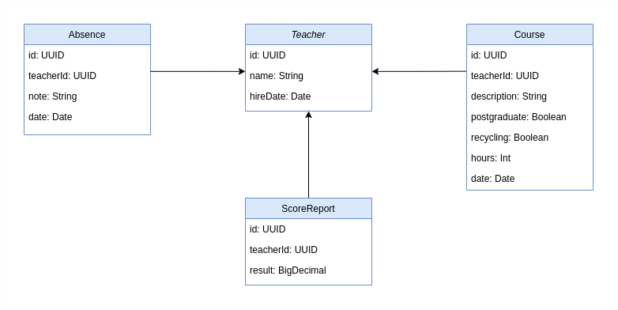

# Teacher Score

## Visão Geral

A Teacher Score é uma aplicação para calcular a pontuação de professores de uma rede hipotética de ensino baseada em 
vários critérios. As funcionalidades disponíveis são:

- Solicitação de cálculo síncrono de score para um professor específico.
- Solicitação de cálculo assíncrono para todos os professores disponíveis.
- Consulta de resultado por professor ou geral.

## Tecnologias Utilizadas

### Linguagem

- **Kotlin**: Linguagem principal utilizada para desenvolvimento da aplicação.

### Frameworks e Bibliotecas

- **Spring Boot**: Framework utilizado para simplificar o desenvolvimento de aplicações stand-alone baseadas em Spring.
- **Spring Data JPA**: Utilizado para persistência de dados e mapeamento objeto-relacional.
- **Detekt**: Ferramenta de lint para garantir a qualidade do código Kotlin.
- **JUnit**: Ferramenta para instância e execução de testes automatizados
- **Mockk**: Ferramenta de mock para classes Kotlin usada nos testes

### Database 
- **H2 Database**: Banco de dados em memória utilizado para desenvolvimento e testes.



### Build e Dependências

- **Gradle**: Ferramenta de automação de builds utilizada para gerenciar dependências e tarefas de build.

### Containerização

- **Docker**: Utilizado para containerizar a aplicação, garantindo um ambiente consistente para desenvolvimento e produção.
- **Docker Compose**: Utilizado para definir e executar a aplicação localmente.

## Pré-requisitos

- Docker e Docker Compose instalados

## Como Executar

### Localmente com Docker

1. Clone o repositório:
   ```sh
   git clone
   cd teacher-score
2. Construa e inicie os containers Docker:
    ```sh
   docker-compose up --build
3. Acesse a aplicação em http://localhost:8080.

### Executando sem Docker
1. Clone o repositório:
   ```sh
   git clone
   cd teacher-score
2. Construa e inicie a applicação com gradle:
    ```sh
   ./gradlew build bootRun
3. Acesse a aplicação em http://localhost:8080.

## Lint

A biblioteca Detekt foi utilizada para garantir a qualidade do código. As configurações estão definidas em 
`detekt-config.yml`.

Para executar o Detekt localmente, utilize o comando:
   ```sh
   ./gradlew detekt
